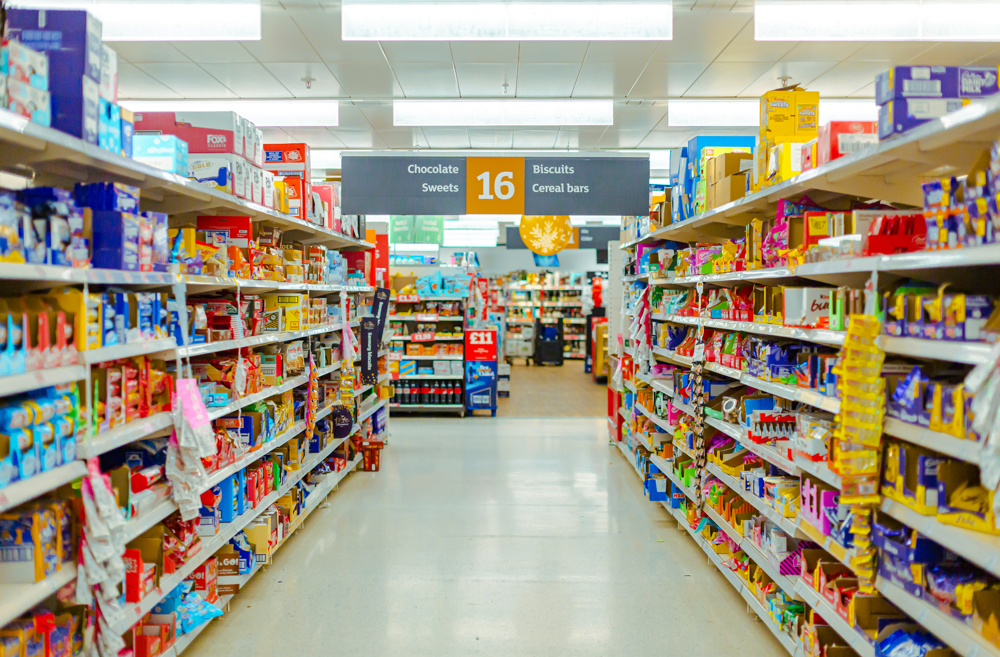

# Data Visualization with Tableau - Superstore Dashboard

<p align="center">
  <br>
  <sub>
    Photo by <a href="https://unsplash.com/@jack19992011?utm_content=creditCopyText&utm_medium=referral&utm_source=unsplash">Jack Lee</a> on <a href="https://unsplash.com/photos/a-grocery-store-aisle-filled-with-lots-of-food-IH65r4HEQWQ?utm_content=creditCopyText&utm_medium=referral&utm_source=unsplash">Unsplash</a>
  </sub>
</p>

## 📌 Project Title
Sales Performance Dashboard for Global Superstore

## 🧑‍💼 User Story
As a Regional Sales Manager, I want an interactive dashboard that provides insights into sales performance, profitability, and shipping efficiency by region, product category, and time. This will help me identify underperforming areas and make informed business decisions to improve profitability.

## 🎯 Project Objectives
1. Provide an overview of sales and profit performance.
2. Analyze sales and profit trends over time (monthly/quarterly).
3. Present geographical performance by region and state.
4. Visualize shipping performance and delivery times.
5. Enable interactive exploration for stakeholders and decision-makers.

## 📦 Dataset Overview
**Dataset Name**: Global Superstore

**Source**: Sample dataset provided by Tableau

**Key Fields**:
- Order ID, Order Date, Ship Date
- Customer ID, Segment
- Region, Country, State
- Product Category, Sub-Category
- Sales, Quantity, Discount, Profit
- Ship Mode

## 🧩 Project Requirements
1. Functional Requirements
   The dashboard must:
   - Display key metrics: Total Sales, Total Profit, Quantity Sold.
   - Include filters by: Year, Region, or anything else relevant for the analysis.
   - Break down performance by Category and Sub-Category.

2. Non-Functional Requirements
   The dashboard should:
   - Be responsive and fast.
   - Be intuitive and user-friendly for non-technical users.
   - Follow consistent design and color themes.
  
## 🧠 Key Business Questions to Answer
1. Which regions generate the most profit?
2. Are there any sub-categories operating at a loss?
3. What are the year-over-year sales trends?
4. How does discounting impact profitability?
5. Are there significant differences in performance between customer segments?

## 📈 Project Deliverables
1. Tableau Workbook (.twbx)
2. Interactive Dashboard (Published to Tableau Public or Tableau Server)
3. Insight Report (Key findings from analysis)

## Data Visualization Process Using Tableau

<p align="justify">
  This project outlines a clear and structured approach to data visualization using the Superstore dataset. The steps below describe the end-to-end process carried out:
  
  1. Dataset Acquisition
   The dataset was obtained from Kaggle under the name "Superstore Dataset". It contains sales transaction data including order details, customer segments, product categories, regions, and more.
  2. Data Understanding
   Before moving into analysis, I thoroughly explored the dataset to understand the available features, the types of data, and the potential for extracting insights aligned with business objectives.
  3. Data Quality Checking in Google Colab (using Python Language)
   I used Google Colab to perform initial exploratory checks on the dataset. This included:
     - Checking for missing values
     - Identifying duplicate records
     - Verifying data types and unique value distributions
  4. No Data Cleaning Required
   After inspection, I found that the dataset was clean—there were no missing values, duplicates, or major inconsistencies. Thus, no additional data cleaning steps were necessary.
  5. Understanding Client Requirements
   I reviewed the business requirements to ensure the visualizations aligned with the client’s goals. This included identifying key metrics such as profit, discount, sales trends, and customer segmentation.
  6. Data Visualization with Tableau
   I imported the dataset into Tableau and created a range of dashboards and charts to uncover insights, including:
     - Sales and profit trends over time
     - Profitability by region and category
     - Impact of discount rates
     - Segment distribution and customer behavior
  7. Data Analysis and Insight Extraction
      Based on the visualizations, I performed in-depth analysis to derive actionable insights. These insights help identify areas of improvement, highlight loss-driving factors, and suggest strategic adjustments (e.g., reducing aggressive discounting in certain sub-categories or shifting focus to high-profit segments).
</p>
     
## Visualization and Analysis

**Trend Sales 2014**
<p align="center">
  <br>
  <div align="justify">
    The 2014 Trend Sales chart illustrates a dynamic sales pattern throughout the year, with several notable fluctuations that reflect seasonal consumer behavior. However, overall, the graph shows a generally upward trend with relatively mild volatility, indicating steady growth over time. The lowest sales were recorded in February (20,284), followed by a significant increase that peaked in November (112,326), likely driven by the year-end shopping season. Although there was a slight decline in December, sales remained high. This pattern highlights consistent growth and suggests strong potential to optimize sales strategies during key periods such as the end of the year.
    </div>
</p>


**Profit by Region and Category**
<p align="center">
  <br>
  <div align="justify">
    The West region recorded the highest overall profit, driven by strong performance in the Office Supplies and Technology categories. In contrast, the two regions with the lowest profits is Central and South that both incurred losses in the Furniture category. This suggests a consistent issue with Furniture in these areas. Further analysis is needed to identify the underlying causes of these losses, such as low market demand in those regions, ineffective discount strategies, or other operational factors that directly contribute to the losses in the Furniture category within these regions.
     </div>
</p>

**Profit by Subcategory - Central Region**
<p align="center">
  <br>
  <br>
  <div align="justify">
    As a continuation of the finding that the Furniture category experienced losses in the Central and South regions, this chart highlights that sub-categories in the Central region—such as Tables (-2,163), Furnishings (-1,320), and Bookcases (-511) this contributed most significantly to the losses within the category. The largest loss came from the Tables sub-category, which may indicate underlying issues related to the product itself or the sales strategy for that line. Additionally, in the Office Supplies category, although it remains profitable overall, there is a notable loss in the Binders sub-category (-3,957), which exceeds the total losses across all Furniture sub-categories. This suggests that despite a healthy appearance at the category level, there may be hidden losses in certain sub-categories that could be weighing down overall profitability. Meanwhile, the Technology category is performing strongly, with Phones (4,120) and Accessories (2,941) emerging as the top profit contributors. This indicates an opportunity to shift sales or promotional focus toward technology products, particularly in regions struggling with losses in Furniture.
In otherside, total sales in the Central region for the Furniture category are actually high. In particular, the Chairs sub-category recorded the highest sales among all sub-categories, reaching 23,218. This highlights show that high sales volume not comparable with profitability. Maybe that aggressive discounting strategies or elevated operational costs are causing profit margins to shrink significantly or even turn negative despite strong market demand.
This highlight us that importance of evaluating performance not just from the sales perspective, but also through of cost efficiency and pricing strategy. If a top-selling sub-category like Chairs still fails to deliver positive profit, it signals a need for comprehensive review of pricing structures, promotional tactics, and target segmentation to ensure long-term profitability.

**Based on these insights, the following actions are recommended:**
1. Conduct a thorough review of pricing, offers, and inventory strategies for the Tables, Chairs, and Binders sub-categories.
2. Evaluate the effectiveness of promotions involving underperforming products.
3. Increase the allocation of promotional efforts or resources toward high-performing sub-categories such as Phones and Accessories, especially in regions with lower profitability.
     </div>
</p>

**Effect of Discount Rates on Profitability in Sub-category (Table)**
<p align="center">
  <br>
  <div align="justify">
    As a follow-up analysis on the Tables sub-category, this chart illustrates a clear negative correlation between discount rates and profitability. When no discount (0%) is applied, Tables still achieve a positive profit of 373. However, at a 20% discount, profit drops sharply to -909, and with a 50% discount, losses deepen to -1,627. This steep decline suggests that aggressive discounting strategies are counterproductive for the Tables sub-category. Instead of boosting sales, high discounts appear insufficient to offset the reduced margins, directly impacting overall profitability.

**Recommendations:**
1. Reevaluate the discounting strategy for Tables. High discounts should be scrutinized to determine whether they truly drive volume or simply erode margins.
2. Experiment with lower discount levels, paired with other tactics such as product bundling, upselling, or loyalty-based offers.
3. Apply customer segmentation to tailor discounts only to price-sensitive segments, rather than offering blanket reductions.
   </div>
</p>

**High Discount Rates on Furniture and Office Supplies in the Central Region**
<p align="center">
  <br>
    <div align="justify">
      The Discount by Region and Category chart shows that in the Central region, both Furniture and Office Supplies categories receive average discount rates above the overall average threshold. In particular, Furniture holds the highest average discount, followed by Office Supplies, while the Technology category receives the lowest. This condition reinforces the assumption that overly aggressive discount strategies for Furniture and Office Supplies are a key factor in reducing profitability, especially evident in sub-categories like Tables and Binders, which record significant losses.
    </div>
</p>

**Customer Segment Distribution (Central Region) : Focus on Home Office**
<p align="center">
  <br>
   <div align="justify">
     The Proportion Segment chart reveals that the Home Office segment accounts for the largest portion of customers in the Central region, representing 48.72%, followed by Consumer (39.48%) and Corporate (11.80%). The dominance of the Home Office segment has important implications for business strategy. This segment typically consists of individuals or small business owners who are more price-sensitive and exhibit purchasing behaviors that differ from corporate clients. Therefore, promotional and discount strategies should be tailored to better align with the preferences and needs of Home Office customers. For example, while aggressive discounts may boost sales volume, they can also negatively impact profitability—as seen in categories like Furniture and Office Supplies—if not supported by healthy profit margins. A more sustainable approach would be to target promotions toward high-margin products or sub-categories with proven profitability, while continuously evaluating discount effectiveness within this segment.
Additionally, communication strategies can be personalized for the Home Office audience by highlighting product benefits such as functionality, space efficiency, or flexibility—features that typically resonate more with this group.
   </div>
</p>

## Dashboard Visualization with Tableau
**Dashboard Superstore - 2014**
<p align="center">
  <br>
</p>

**Dashboard Superstore Specific in Central Region**
<p align="center">
  <br>
</p>

## 🛠️ Built With

- **Tableau**
- **[Pandas](https://pandas.pydata.org/)** – For data processing.
- **[Matplotlib](https://matplotlib.org/)** and **[Seaborn](https://seaborn.pydata.org/)** – For data visualization.
- **OpenPyXL** – For reading Excel files (`.xlsx`).

## 📑 Data
 This data was taken from Kaggle
 
## 📦 Requirements

Install the required Python libraries using:

```bash
pip install -r requirements.txt
```


## 👩‍💻 Author

**Sinta Miftakhul Rohmah**  
Applied Mathematics student  
Universitas Islam Negeri Sunan Kalijaga, Yogyakarta  
📫 [LinkedIn](https://www.linkedin.com/in/sintamiftakhulr/)
